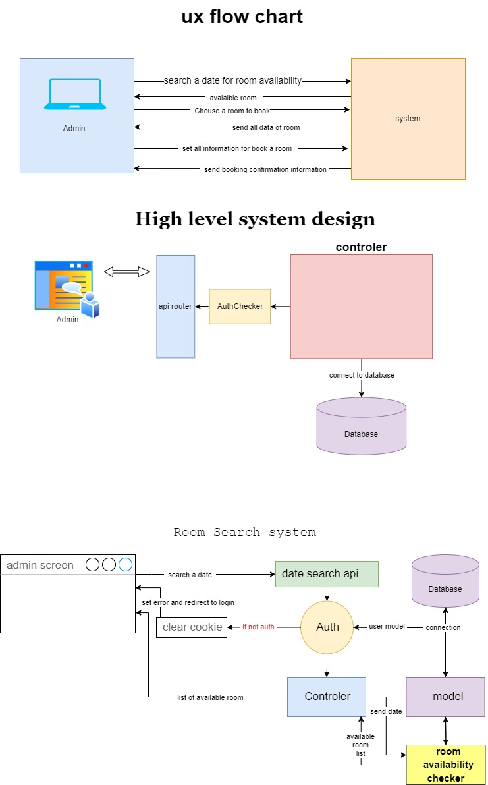

# Resortdesk
Resort and hotel managment system use Node-Js, React-Js, MySql

------------
This System built using React for the front-end, Node.js for the back-end, and MySQL as the database. The system allows Admin to browse available hotel rooms, make reservations, and manage bookings.

### Technologies Used
- React
- Node.js
- Express
- MySQL
- Axios (for API calls)
- React Router (for client-side routing)
- Tailwindcss (for styling)

------------

# system design 

